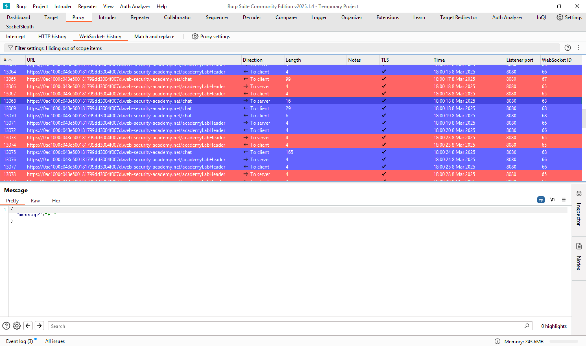

# PwnFox-WebSocket

PwnFox-WebSocket is a Burp extension that added WebSocket support for PwnFox.



## Installation

1. Make sure you already installed [PwnFox](https://github.com/yeswehack/PwnFox) first.

2. Find PwnFox-WebSocket latest build here https://github.com/back2arie/PwnFox-WebSocket/releases

3. Go to Extensions and add `PwnFox-WebSocket.jar` as a java extension.

## Build

```bash
mvn clean package
```
